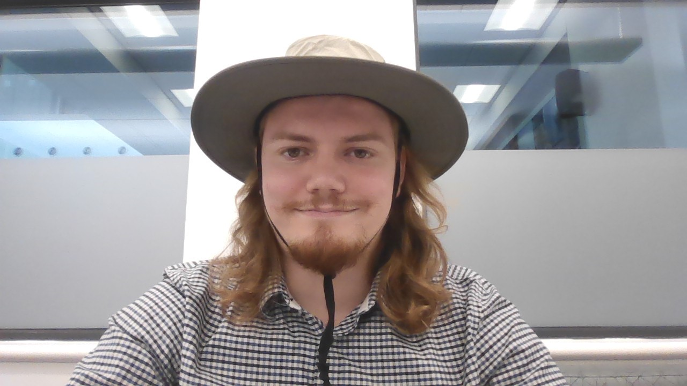
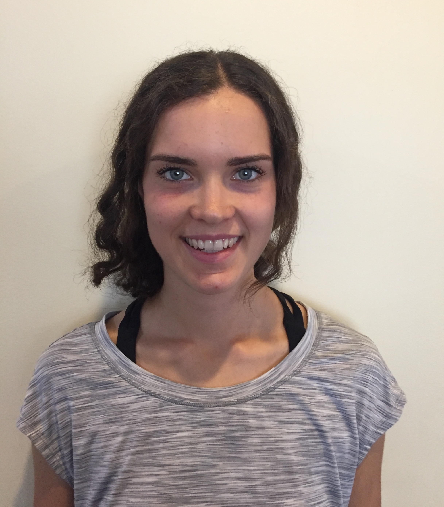

# Open Problem Bank in Statistics

## Project Team Members

| Name             | GitHub handle  |
|------------------|----------------|
| Firas Moosvi     | [firasm](http://github.com/firasm)  |
| Irene Vrbik     | [firasm](http://github.com/vrbiki)  |

## Bios

### Principal Investigators

 </img>

#### **Dr. Irene Vrbik**

Irene is currently an Assistant Professor of Teaching in the subject area of Statistics and Data Science.
As an Educational Leadership faculty, she is interested in applying Machine Learning techniques to help understand and improve curriculum.

    

 </img>

#### **Dr. Firas Moosvi**

Firas Moosvi is a Lecturer at UBC Vancouver in the Computer Science department.
He teaches courses in Data Science, and Computer Science at the undergraduate and graduate levels.
He has many research interests and they fall under three main umbrellas: medical imaging for applications in cancer, scholarship of teaching and learning (SoTL), and learning analytics.
Most recently, he is looking at how the field of learning analytics can provide insight to surface and reduce inequities in STEM programs.
Firas has a deep appreciation for data visualization, active learning, and open source projects.   

<!-- 
### Graduate students

 </img> -->

### Undergraduate students

 </img>
**Samuel Street**
Hello, my name is Samuel Street,
I am an applied mathematics major who is minoring in data science. I just finished my third year and look forward to doing some work this summer. I like school quite a bit and really like math along with just about anything to do with technology. Recently I have taken a bit of an interest in Python and how games can be made with it along with learning more about data science. I find data science fascinating. It is amazing to me that a data scientist can make predictions in fields in which they possess little specific expertise; for example, a data scientist, given enough data is able to make a well-educated guess as to whether or not someone has diabetes or other diseases even if that person knows very little of the disease itself. I also find coding in general to be quite interesting, it is really cool to me how much can be done with code. I find it almost beyond belief how fast a computer is, able to calculate and compare numbers, doing what a human computer would take years to compute in only a few seconds. 

 </img>
**Sofie Varabioff**
Hello, I’m Sophie.
 
This May I will be graduating from UBC’s engineering physics program. While I try to figure out how to build and lead the life that I want, I will be working on the open problem bank project, driving ferry boats, and enjoying summer in Vancouver. Throughout my degree I had the opportunity to be apart of a diverse array of projects, many of which are highlighted on my website - www.sophievarabioff.ca - which was a project in itself to learn how to build from scratch, haha!
 
Some other tidbits about me – I’m semi-fluent in French, learning Italian, and think if I ended up on an island in the Mediterranean I’m not sure if I would leave. I’d absolutely love to meet and chat with a naval architect and learn about ship design (I love boats, if that wasn’t noted before). Activities, especially outdoor ones like backpacking and skiing, are my idea of a weekend well spent!

 </img>
**Larry Gu**
My name is Larry Gu. I am in Computer Science Honours and Math Minor. My academic journey has led me to develop a diverse range of interests, with a particular passion for mathematical proof and statistics.  I have also found fulfilment in the field of creative education in computer science. I have experience being a TA for multiple first year computer science courses. They deepened my appreciation for effective teaching methodologies. And it is part of the reason why I evaluated the efficacy of applying spaced repetition algorithms in learning MIPS assembly language for my honours thesis. I am excited to gain hands-on experience with our dynamic question generation tool. I firmly believe that such a tool, with the combination of spaced repetition algorithm, has the potential to revolutionize the learning experience and shape the future of education.

I look forward to working with all of you, bringing our collective knowledge and passion for science to create a remarkable question bank. 

 </img>
**Camilla Ren**
Hi everyone! I'm Camilla, a third-year student majoring in Mathematics with a minor in Data Science at UBC Vancouver. I have a deep passion for several areas such as data mining, visualization, machine learning, and web and software development. Apart from my academic pursuits, I've embarked on an exciting entrepreneurial journey as the co-founder of R’cizze, an innovative start-up that operates the world's first sustainability-only platform. It is dedicated to offering a diverse range of upcycled and sustainable products and advocating for slow fashion by promoting sustainable brands worldwide and nurturing future designers. On a personal note, I love travelling, food and tennis. 
I’m really excited about contributing to this project that can have a direct impact on the learning experiences of future students and gain real-world experience.

 </img>
**Christina Yang**
Hi everyone! My name is Christina, and I have just finished my 2nd undergraduate year of studying Computer Science at UBC Vancouver. My interests lie in Computer Science, and I spend my free time building web applications, reading, and playing board games. I find I learn best by solving problems, so I am excited to work on a question bank that will improve the learning experience for other students.

 </img>
**Alejandro Builes**
Hey there! I am Alejandro Builes. I will be just starting my fourth year at the University of British Columbia Okanagan, studying Data Science. I am really interested in data visualization projects to make data-driven decisions. I am delighted with the idea of transforming raw, often chaotic data into a visually appealing format. 

Also, I'm excited about making education better and not sticking to old ways. I mean, every field out there is evolving, right? So, why should education be any different? Hence, I'm extremely proud that this project is part of that change. 

Aside from academics, I like to be outside, whether that's hiking, playing soccer or snowboarding. And when I'm not out and about, I'm usually playing guitar, reading (hopefully) a good book, and spending time with my friends. My dream? Becoming a sports data analyst, to take all this data stuff and use it to analyze soccer in the big European leagues. Beautiful game, meet beautiful data!

