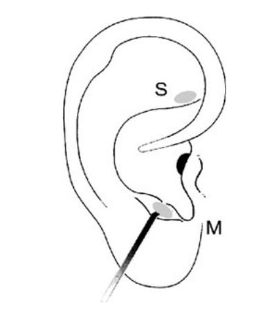

# {{ params.vars.title }}
A migraine is a particularly painful type of headache, which patients sometimes wish to treat with acupuncture. To determine whether acupuncture relieves migraine pain, researchers conducted a randomized controlled study where ${{ params.description.num1 }}$ females diagnosed with migraine headaches were randomly assigned to one of two groups: treatment or control. ${{ params.description.num2 }}$ patients in the treatment group received acupuncture that is specifically designed to treat migraines. ${{ params.description.num3 }}$ patients in the control group received placebo acupuncture (needle insertion at non-acupoint locations). ${{ params.description.num4 }}$ hours after patients received acupuncture, they were asked if they were pain free. Results are summarized in the contingency table below.

| Group | Pain free | Not pain free | Total |
| :------------ | :------------: | :------------: | ------------: |
| Treatment | {{ params.table0.r2.c2 }} | {{ params.table0.r2.c3 }} | {{ params.table0.r2.c4 }} |
| Control | {{ params.table0.r3.c2 }} | {{ params.table0.r3.c3 }} | {{ params.table0.r3.c4 }} |
| Total | {{ params.table0.r4.c2 }} | {{ params.table0.r4.c3 }} | {{ params.table0.r4.c4 }} |

## Part 1

What percent of patients in the treatment group were pain free ${{ params.part1.num1 }}$ hours after receiving acupuncture? Round to 1 decimal place.

### Answer Section

Please enter in a numeric value in.

## Part 2

What percent were pain free in the control group? Round to 1 decimal place.

### Answer Section

Please enter a numeric value in.

## Part 3

In which group did a higher percent of patients become pain free ${{ params.part3.num1 }}$ hours after receiving acupuncture?

### Answer Section

- {{ params.part3.ans1.value }}
- {{ params.part3.ans2.value }}

## Part 4

Your findings so far might suggest that acupuncture {{ params.part3.phrase1 }} an effective treatment for migraines for all people who suffer from migraines. However, this is not the only possible conclusion that can be drawn based on your findings so far. What is one other possible explanation for the observed difference between the percentages of patients that are pain free ${{ params.part4.num1 }}$ hours after receiving acupuncture in the two groups?

### Answer Section

## Attribution

Problem is from the [OpenIntro Statistics](https://openintro.org/book/os/) textbook, licensed under the [CC-BY 4.0 license](https://creativecommons.org/licenses/by/4.0/). 