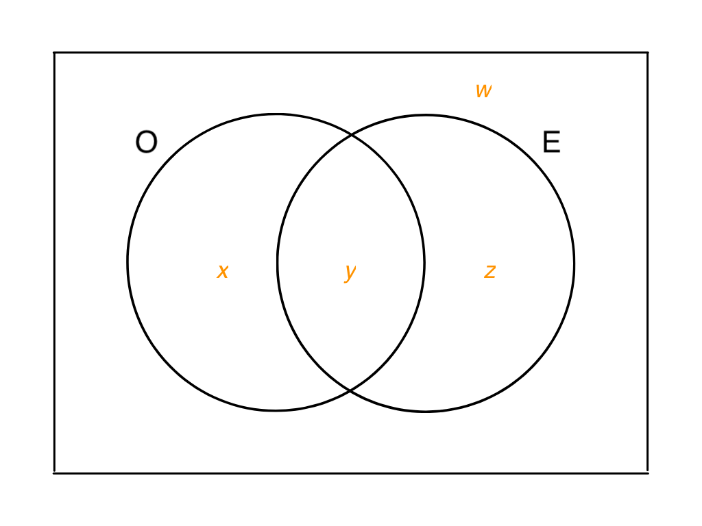

# {{ params.vars.title }}
<table style="width:100%">
  <tr>
    <th></th>
    <th>AC</th>
    <th>B</th>
    <th>AB</th>
    <th>O</th>
  </tr>
  <tr>
    <th>Rh positive </th>
    <td>${{ params.a_pos }}$</td>
    <td>${{ params.b_pos }}$</td>
    <td>${{ params.ab_pos }}$</td>
    <td>${{ params.o_pos }}$</td>
  </tr>
  <tr>
    <th>Rh negative</th>
    <td>${{ params.a_neg }}$</td>
    <td>${{ params.b_neg }}$</td>
    <td>${{ params.ab_neg }}$</td>
    <td>${{ params.o_neg }}$</td>
  </tr>
</table>

A person with type O blood and a negative Rh factor can donate blood to any blood type. We define the following events:

- A: The person has blood type
- B: The person has blood type B.
- C: The person has blood type AB
- D: The person has blood type O
- E: The person is Rh positive
- F: The person is Rh negative

1. A and O are mutually exclusive (since it is impossible for a person to have both bloodtypes)

1. Events A and E are _not_ mutually exclusive (since 6% of population have blood type A and a postive Rh, that is $P(A\cap E) \neq 0$)

1. Events E and F are compliments since\
   $P(E) + P(F) = 1$\
   $P(E) = 1 - P(F)$\
   $ {{ params.a_pos }} + {{ params.b_pos }} + {{ params.ab_pos }} + {{ params.o_pos }} = 1 - ({{ params.a_neg }} + {{ params.b_neg }} + {{ params.ab_neg }} + {{ params.o_neg }} )$\
   ${{ params.lh }} = 1 - {{ params.rh }}$

Round all answers to 3 decimal places.

## Part 1

What is the value of $w$ in the venn diagram above.

### Answer Section

Please enter a numeric value in.

## Part 2

What is the value of $x$ in the venn diagram above.

### Answer Section

Please enter a numeric value in.

## Part 3

What is the value of $y$ in the venn diagram above.

### Answer Section

Please enter a numeric value in.

## Part 4

What is the value of $z$, in the venn diagram above.

### Answer Section

Please enter a numeric value in.

## Part 5

Calculate $P(O)$

### Answer Section

Please enter a numeric value in.

## Part 6

Given that a randomly selected person has type O what is the probability that they can donate blood to any person with any blood type?

### Answer Section

Please enter a numeric value in.

## Attribution

Problem is from the [OpenIntro Statistics](https://openintro.org/book/os/) textbook, licensed under the [CC-BY 4.0 license](https://creativecommons.org/licenses/by/4.0/). 