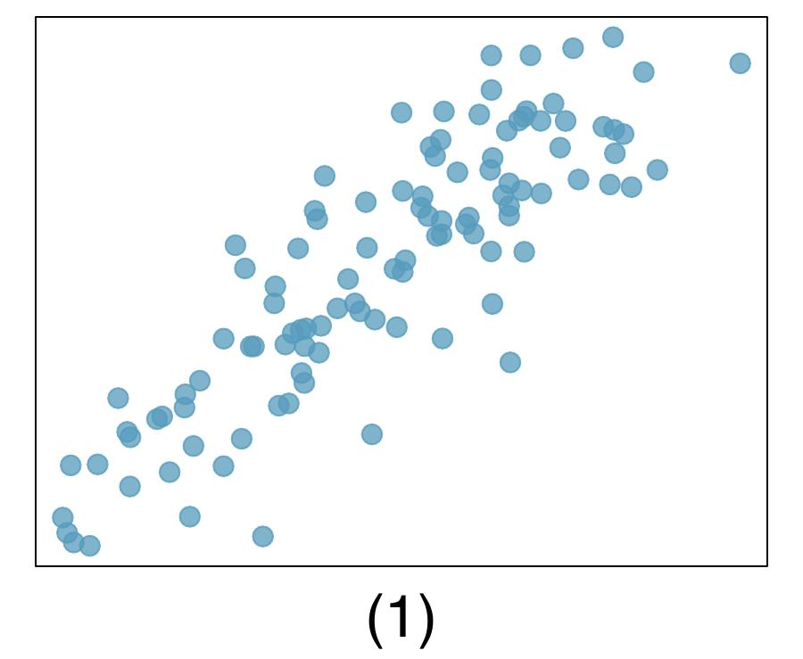
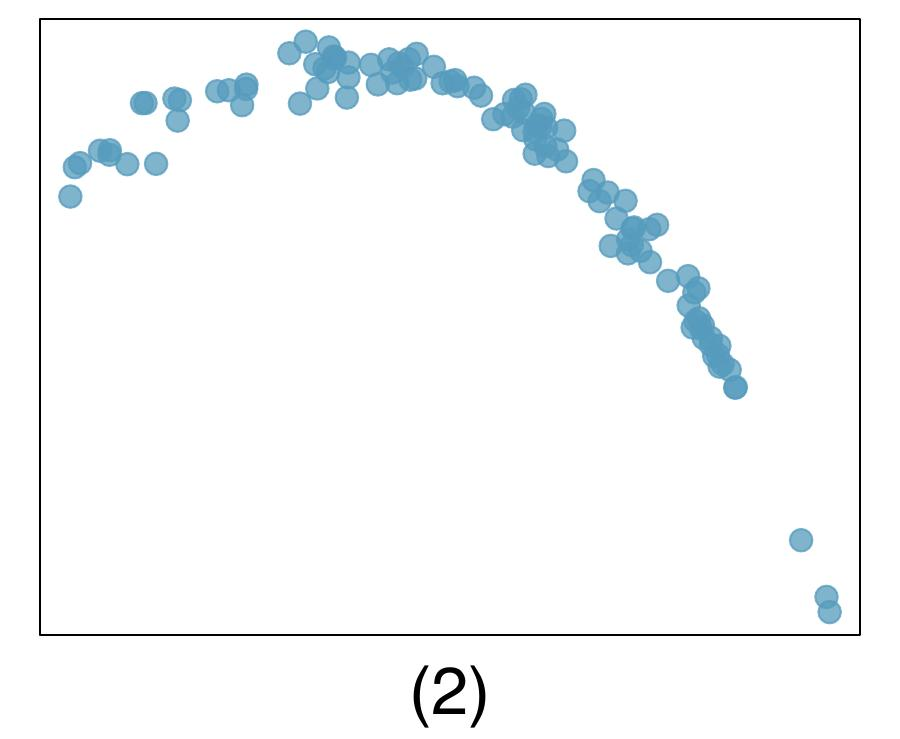
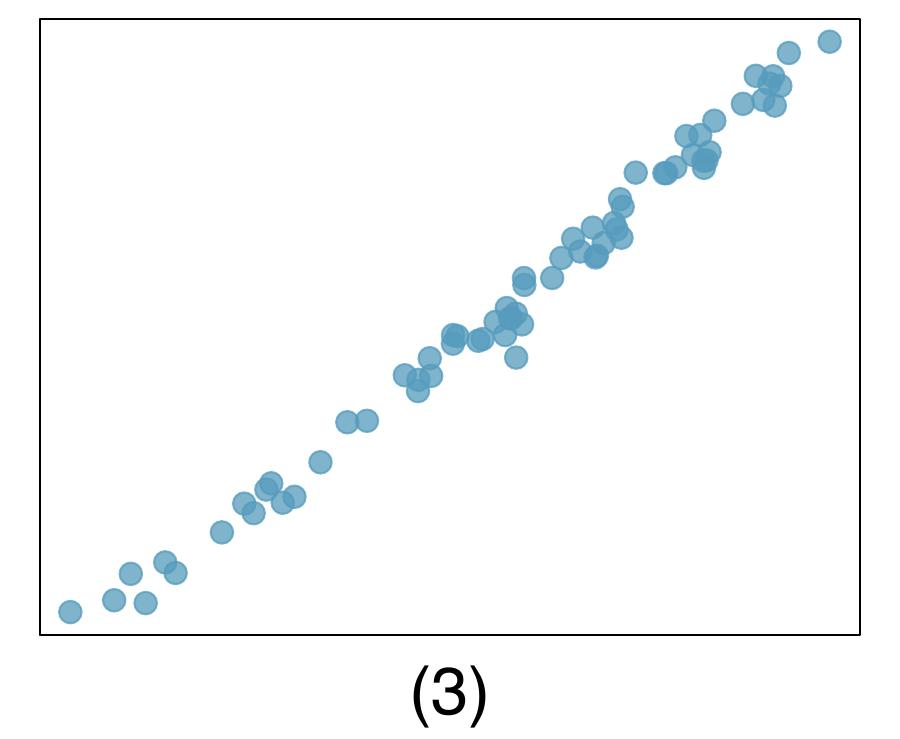
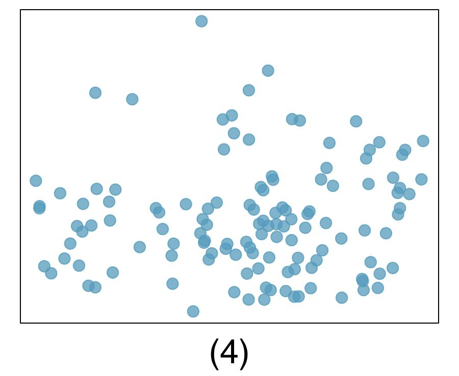

# {{ params_vars_title }}
Match each correlation to the corresponding scatterplot.

<!-- 

 -->

<pl-figure file-name="figure 1.png" type="dynamic" width="500px"></pl-figure>

## Part 1

### Answer Section

## Attribution

Problem is from the [OpenIntro Statistics](https://openintro.org/book/os/) textbook, licensed under the [CC-BY 4.0 license](https://creativecommons.org/licenses/by/4.0/). 